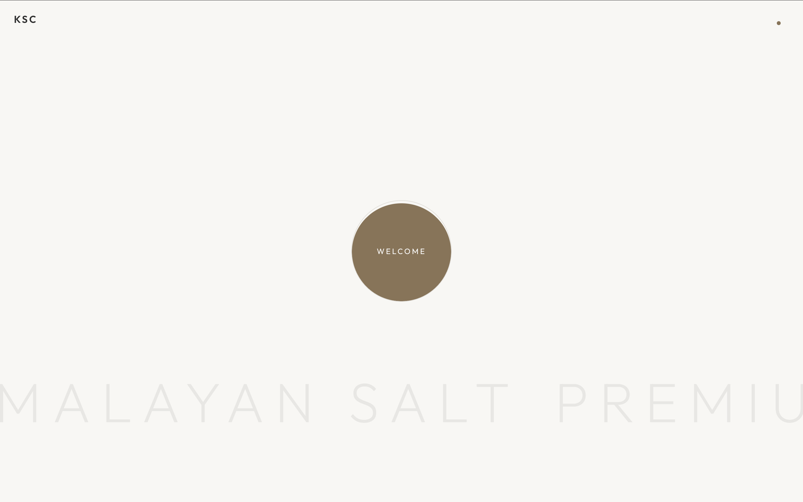
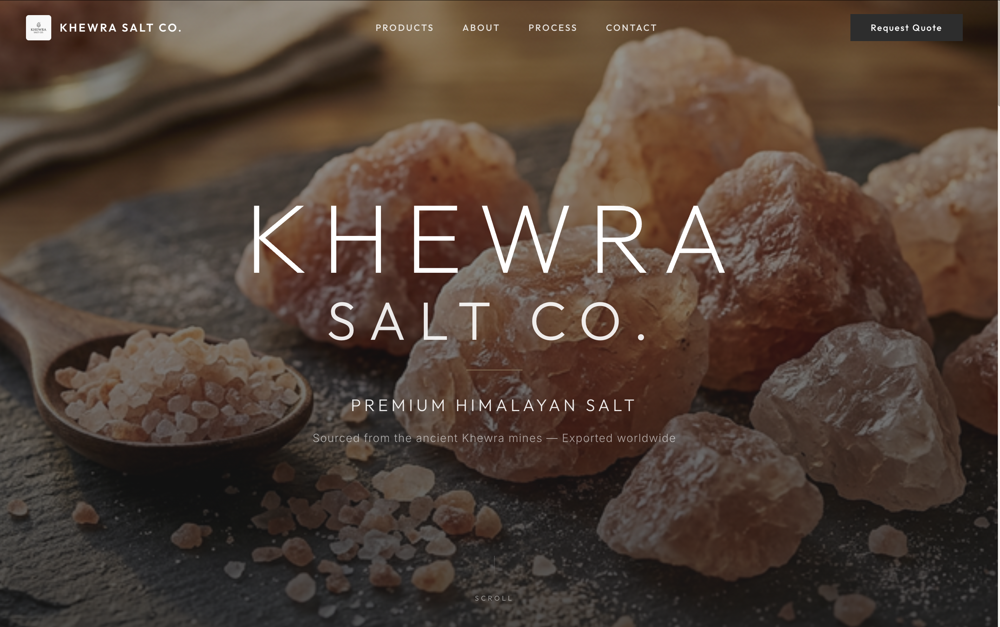
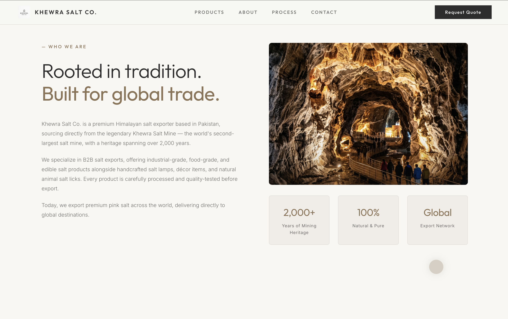
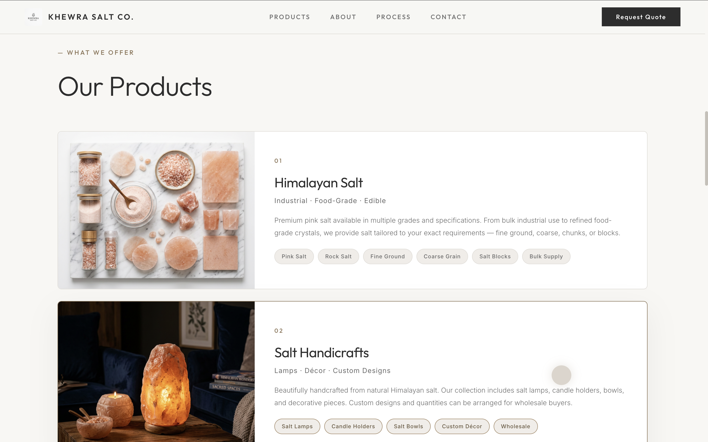
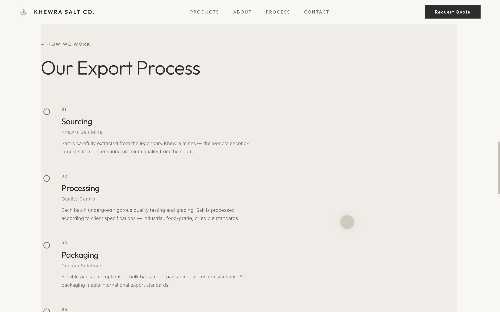
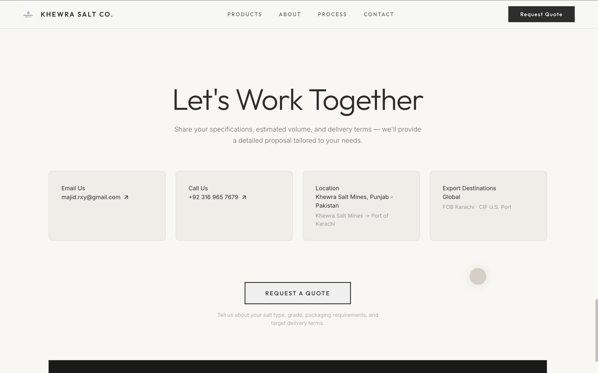
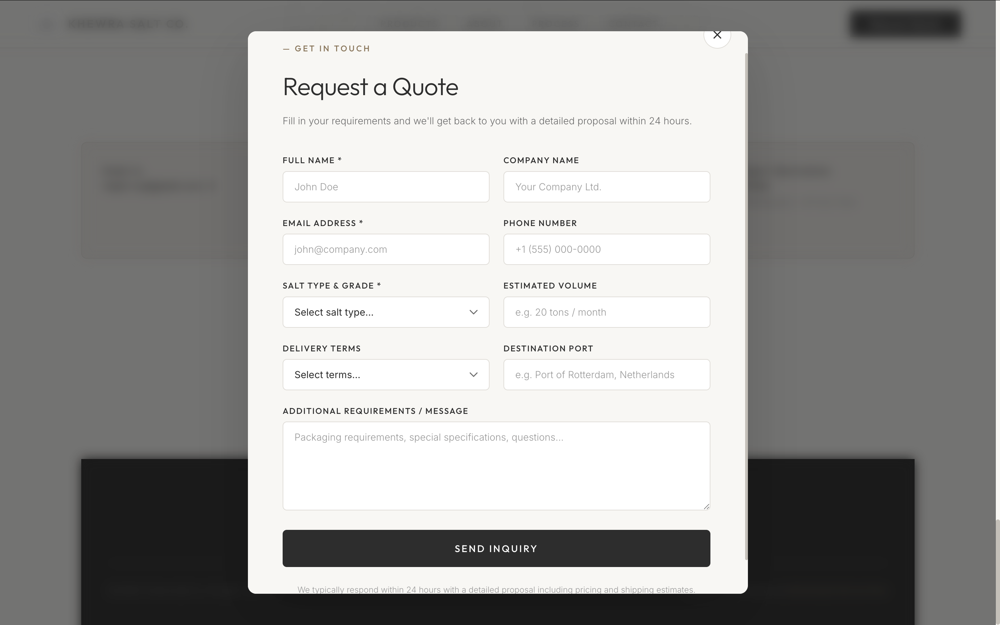

# Khewra Salt Co.

A single-page marketing site for **Khewra Salt Co.** — premium Himalayan salt from Pakistan’s Khewra mines, aimed at B2B buyers and international export. The experience includes scroll-driven storytelling, product highlights, process, gallery, contact, and a **Request quote** flow (modal + [EmailJS](https://www.emailjs.com/) where configured).

## Interface preview

Screenshots live in **`docs/screenshots/`** (repo-only assets, not part of the Vite `public/` build).

### Loading & welcome interface

Minimal entry screen: **KSC** branding, centered **WELCOME** control, and large background type for the Himalayan salt positioning.



### Hero & top navigation

Hero with salt photography, **KHEWRA SALT CO.** headline, **Premium Himalayan Salt** subcopy, primary nav (Products · About · Process · Contact), **Request Quote** CTA, and scroll cue.



### About (“Who we are”) interface

Two-column layout: heritage copy, mine photography, and stat cards (mining heritage, natural purity, export network).



### Products catalog interface

**Our Products** with numbered category rows: Himalayan salt grades (industrial / food-grade / edible) and salt handicrafts (lamps, décor, wholesale), each with imagery, description, and tag pills.



### Export process interface

**Our Export Process** vertical timeline (**How we work**): sourcing → processing → packaging → logistics, with section framing and accent line.



### Contact & CTAs interface

**Let’s work together** block with email, phone, location / route, export destinations (FOB / CIF), and **Request a quote** button with supporting microcopy.



### Quote request modal

Modal form: company details, salt type / grade, volume, delivery terms, destination port, message, and **Send inquiry** — over a blurred page backdrop.



## Features

- Responsive layout with navigation and section anchors  
- Hero, about, products, process, image gallery, and contact  
- Custom cursor on large screens  
- 3D character scene ([React Three Fiber](https://docs.pmnd.rs/react-three-fiber/getting-started/introduction))  
- Scroll animations ([GSAP](https://gsap.com/) + ScrollTrigger)  
- Optional analytics via [@vercel/analytics](https://vercel.com/docs/analytics)

## Tech stack

React, TypeScript, Vite, GSAP, Three.js / R3F, CSS

## Getting started

```bash
npm install
npm run dev
```

- Dev server: Vite (see `package.json` for `dev` / `build` / `preview`).  
- Production build: `npm run build` — output in `dist/`.

### Environment (quote form)

Create a `.env` in the project root (not committed) with:

- `VITE_EMAILJS_SERVICE_ID`
- `VITE_EMAILJS_TEMPLATE_ID`
- `VITE_EMAILJS_PUBLIC_KEY`

Without these, the quote modal falls back to an in-app message with a direct email address.

## GSAP (for developers)

This project uses **GSAP bonus plugins** (e.g. ScrollSmoother, SplitText). For **production** deployments you need a valid [GSAP Club](https://gsap.com/docs/v3/Installation/) setup per their license; trial-only files are not for hosted commercial use.

## License

This project is available under the [MIT License](LICENSE).
